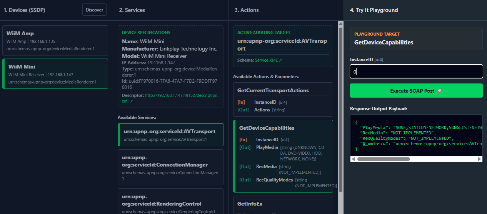

# 📡 UPnP Explorer

<!-- Badges -->

[](https://github.com/cvdlinden/upnp-explorer/blob/main/LICENSE)

A modern, fast, and completely zero-build UPnP (Universal Plug and Play) and SSDP developer tool and playground built with **Node.js v24** and vanilla web standards.

This tool continuously scans your local network for UPnP-capable devices (like Smart TVs, NAS systems, media renderers, routers, and smart hubs), inspects their service schemas, and exposes a dynamic 4-column interactive playground to execute live SOAP requests.



## 🚀 Key Features

- **Robust Windows 11 Routing**: Custom multi-socket network engine that binds isolated UDP sockets per physical network interface to guarantee stable device discovery.
- **Zero-Build Architecture**: Pure JavaScript frontend (ES Modules, native CSS Nesting, native Grid/Flexbox layouts) without Webpack, Vite, Tailwind, or Babel compilation.
- **Real-Time Synchronization**: Leverages lightweight, native Server-Sent Events (SSE) to push discovered local hardware live to the UI without Socket.io or manual polling.
- **Deep Introspection**: Resolves device descriptors, parses hierarchical XML layouts into clean JSON schemas, and dynamically maps parameter contracts (`[In]` and `[Out]` types) for all actions.
- **Execution Playground**: Provides an automated interactive UI to easily forge and transmit valid UPnP SOAP envelope commands to local hardware targets.

## 📁 Project Architecture

```text
upnp-explorer/
├── docs/                # Architectural diagrams, tech stack and API specs
├── lib/
│   ├── parser.js        # Stateless HTTPU text line parser & XML-to-JSON engine
│   ├── socket.js        # Multi-interface UDP multicast/unicast socket core
│   └── store.js         # Reactive in-memory registry caching found UPnP devices
├── public/              # Static frontend delivery folder
│   ├── css/styles.css   # Native modern styling rules (requires a modern browser!)
│   └── js/app.js        # Fully encapsulated client orchestration namespace
├── tests/               # Automated unit tests running on Node's native engine
├── index.js             # Express application gateway and process lifecycle orchestrator
└── package.json         # Configuration declaring pure ES Modules ("type": "module")
```

## 🛠️ Getting Started

### Prerequisites

- **Node.js v24.x** or higher installed.

### Installation

Clone the repository and install the minimal dependencies (`express` and `fast-xml-parser`):

```bash
git clone https://github.com
cd upnp-explorer
npm install
```

### Running the Application

**Development (with native hot-reloading file watch):**

```bash
npm run dev
```

**Production Start:**

```bash
node index.js
```

Once started, navigate your web browser to `http://localhost:3000` to load up the interactive control dashboard.

## 🧪 Quality & Control

### Running Code Scans (ESLint)

Analyze formatting standards and syntax quality over JavaScript code frames:

```bash
npm run lint
```

### Running the Test Suite

Execute isolated module assertion unit tests powered completely by the **native Node.js Test Runner**:

```bash
npm run test
```

## 📃 Documentation

See [./docs/index.md](./docs/index.md).

## 📜 License

This project is licensed under the [**GPL-3.0 License**](LICENSE).  
See the repository settings for full documentation text rules.
